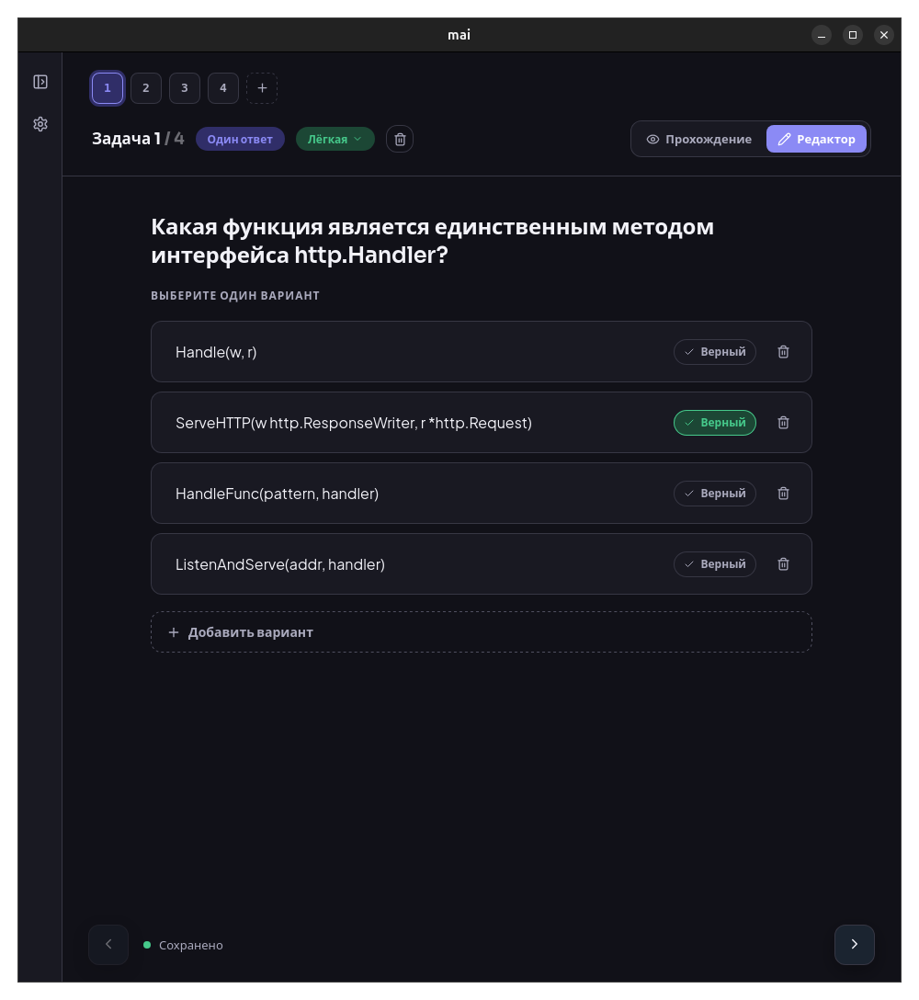
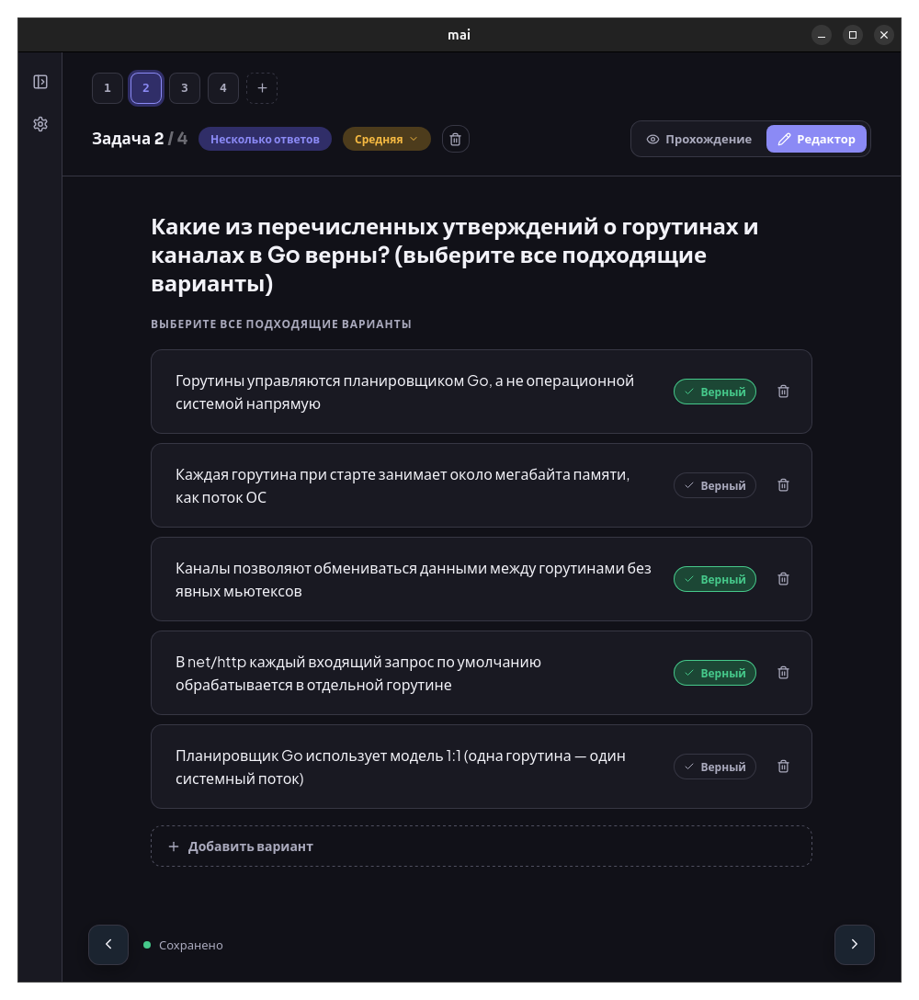
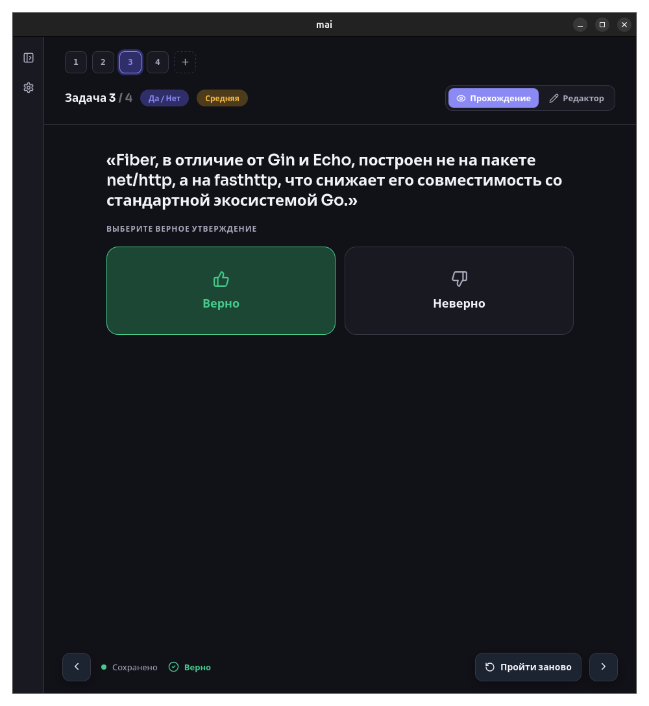
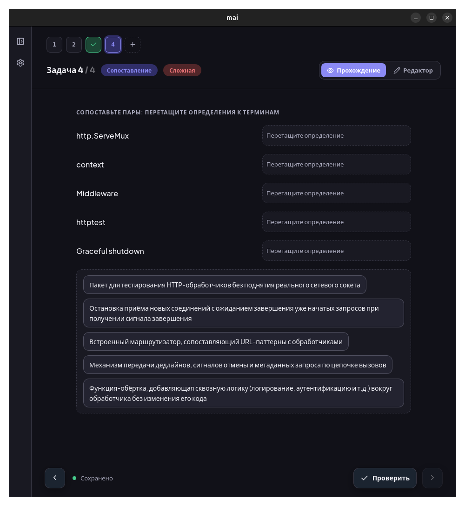

# Mai

[English](README.md) | [Русский](README.ru.md)

> A self-learning platform: you decide what to learn, and Mai turns it into a
> structured course that you create, organize, and actually finish — at your
> own pace.

[](LICENSE)

## Screenshots

<p align="center">
  <a href=".github/assets/home.png"></a>
  <a href=".github/assets/courses.png"></a>
</p>

<p align="center">
  
</p>

<p align="center">
  <a href=".github/assets/task-editor-choice.png"></a>
  <a href=".github/assets/task-editor-multi-choice.png"></a>
  <a href=".github/assets/task-passing-true-false.png"></a>
  <a href=".github/assets/task-passing-matching.png"></a>
</p>

## Tech stack

Tauri v2 · Rust · React + TypeScript · SQLite · Jotai · TipTap

## Getting started

Prerequisites: [Rust](https://rustup.rs), Node.js 20+, [Yarn](https://yarnpkg.com).
On Linux, the [Tauri system dependencies](https://v2.tauri.app/start/prerequisites/) are also required.

```bash
git clone https://github.com/MaiLearning/mai.git
cd mai
yarn install
yarn tauri dev
```

## Build & Test

```bash
yarn build          # frontend production build (tsc + vite)
yarn tauri build    # application bundle
yarn test           # Vitest
cargo clippy        # run from src-tauri/
```

## Documentation

Internal documentation (architecture, entities, plugin contract) is in Russian:

- `src/entities/ENTITIES.md` — domain entities and data flow
- `src/plugins/PLUGINS.md` — internal plugin contract

## License

Released under the [MIT](LICENSE) license.
