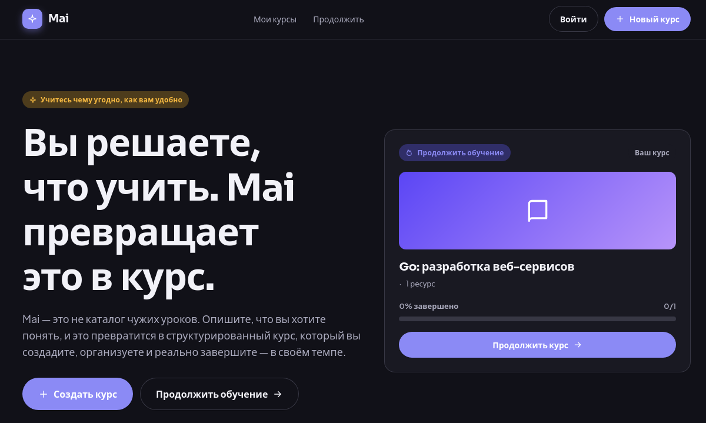
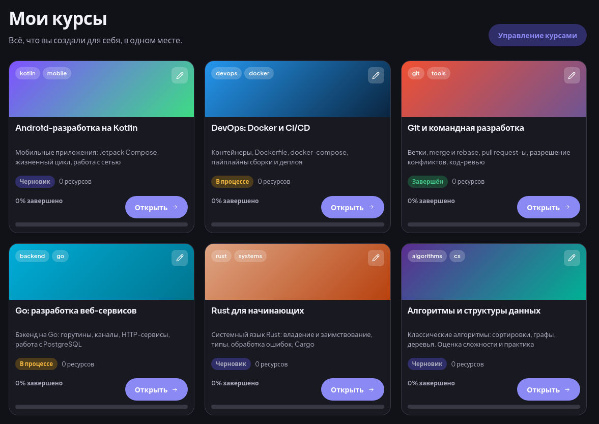
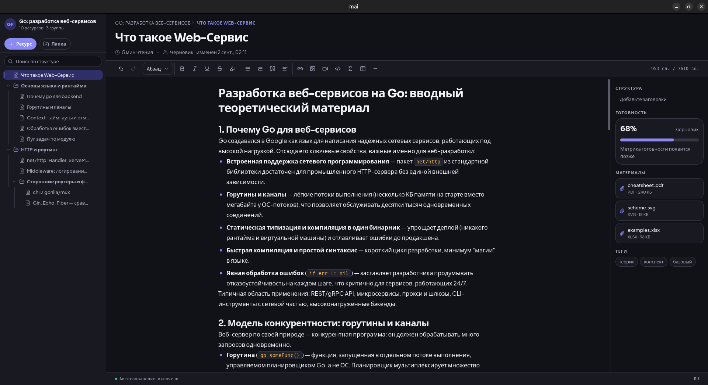

# Mai

[English](README.md) | [Русский](README.ru.md)

> Платформа для самостоятельного обучения: вы решаете, что учить, а Mai
> превращает это в структурированный курс, который вы создаёте, организуете
> и реально завершаете — в своём темпе.

[](LICENSE)

## Скриншоты

| Главная | Курсы |
| --- | --- |
|  |  |



## Технологии

Tauri v2 · Rust · React + TypeScript · SQLite · Jotai · TipTap

## Начало работы

Требования: [Rust](https://rustup.rs), Node.js 20+, [Yarn](https://yarnpkg.com).
На Linux дополнительно нужны [системные зависимости Tauri](https://v2.tauri.app/start/prerequisites/).

```bash
git clone https://github.com/MaiLearning/mai.git
cd mai
yarn install
yarn tauri dev
```

## Сборка и тесты

```bash
yarn build          # production-сборка фронтенда (tsc + vite)
yarn tauri build    # бандл приложения
yarn test           # Vitest
cargo clippy        # запуск из src-tauri/
```

## Плагины

Mai расширяется плагинами. SDK для разработки плагинов (`mai-lib`, `mai-cli`)
будет опубликован отдельно.

## Документация

Внутренняя документация (архитектура, сущности, контракт плагинов) — на русском:

- `AGENTS.md` — обзор проекта для контрибьюторов и агентов
- `src/entities/ENTITIES.md` — доменные сущности и поток данных
- `src/plugins/PLUGINS.md` — контракт внутренних плагинов

## Лицензия

Распространяется по лицензии [MIT](LICENSE).
