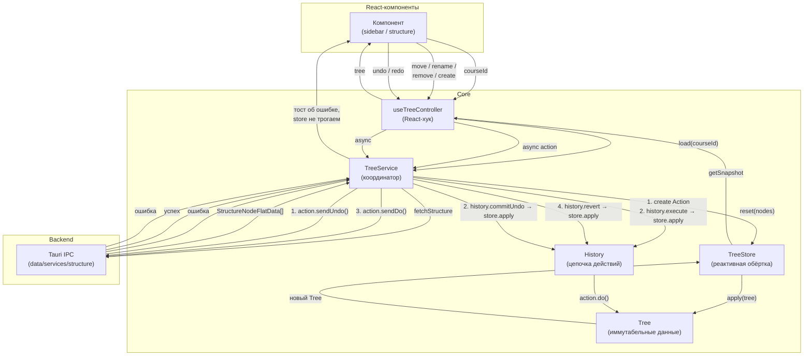

## Core

Core — это ядро дерева, которое используется React-компонентом для управления иерархией, историей действий и синхронизацией с backend. Основной способ взаимодействия — хук `useTreeController`, который экспортируется из данной директории.

## Компоненты core

Ядро состоит из ряда взаимосвязанных модулей:

### `Tree`
Иммутабельное дерево иерархии курса. Единственный источник правды (SSOT) для структуры узлов. Любое изменение (move, rename, remove, insert) возвращает **новый** экземпляр Tree, не мутируя старый. Хранит три внутренних индекса:

- **ItemMap** — `Record<id, Item>`: O(1)-доступ к данным узла
- **ChildrenMap** — `Record<parentId, childId[]>`: иерархия «родитель → дети»
- **ParentsMap** — `Map<childId, parentId>`: обратная связь для O(1)-поиска родителя и расчёта глубины

### `TreeStore`
Мутабельная обёртка над иммутабельным Tree для реактивного взаимодействия с React. Реализует паттерн push-подписки:

- `getSnapshot()` — возвращает текущий Tree (для `useSyncExternalStore`)
- `subscribe(cb)` — добавляет слушатель изменений, возвращает `unsubscribe`
- `apply(tree)` — заменяет внутреннее дерево и вызывает `notify()`
- `reset(nodes)`, `move(...)`, `rename(...)`, `remove(...)`, `insert(...)` — методы, которые создают новый Tree через иммутабельные операции и оповещают подписчиков

### `History`
Цепочка действий (Command Pattern) для undo/redo. Хранит массив `Action` и указатель `pointer` на текущее (последнее применённое) действие. При `execute()` обрезает future (все, что было после pointer), добавляет новое действие и применяет его к store. Undo/redo сдвигают pointer и применяют `action.undo()` / `action.do()`.

### `TreeService`
Координатор между TreeStore (локальное состояние), History (цепочка действий) и backend (Tauri IPC). Каждая мутация:

1. Создаёт Action (MoveAction, RenameAction, RemoveAction, CreateAction)
2. Вызывает `history.execute(action, store)` — применяет к store **оптимистично**
3. Пытается отправить действие на backend через `action.sendDo()`
4. При ошибке backend — `history.revert(store)` откатывает store и удаляет action из цепочки

Undo/redo работают **backend-first**: сначала `sendUndo()` / `sendDo()`, и только при успехе — `commitUndo()` / `commitRedo()`, которые применяют действие к store.

### `useTreeController`
React-хук, связывающий TreeStore и TreeService:

- Lazy-инициализация store + service через `useRef`
- Загрузка данных через `service.load(courseId)` в `useEffect`
- Подписка на store через `useSyncExternalStore` — реактивные обновления без лишних re-render
- Стабильные `useCallback`-обёртки для move, rename, remove, create, undo, redo
- `canUndo` / `canRedo` — read-only флаги на момент рендера

## Схема взаимодействия



## Поток данных

### Инициализация

```
Компонент
  └─ useTreeController(courseId)
       ├─ создаёт TreeStore([]) + TreeService(store)
       └─ useEffect → service.load(courseId)
            ├─ fetchStructure(courseId)      — Tauri IPC
            ├─ store.reset(toNodes(flat))    — сборка Tree
            └─ useSyncExternalStore          — React получает свежий tree
```

### Мутация (move / rename / remove)

```
Компонент вызывает move(id, newParentId, position)
  └─ TreeService.move(...)
       ├─ 1. Создаёт MoveAction (с oldParent + oldPosition)
       ├─ 2. History.execute(action, store)  — action.do() → store.apply()
       │     └─ React видит новый tree (оптимистично)
       ├─ 3. action.sendDo()                 — Tauri IPC
       └─ 4. При ошибке → History.revert(store) — откат
```

### Undo / Redo

```
Компонент вызывает undo()
  └─ TreeService.undo()
       ├─ 1. History.getUndoAction()
       ├─ 2. action.sendUndo()               — backend-first
       │     ├─ успех → History.commitUndo(store) → store.apply() → React
       │     └─ ошибка → тост, store не трогаем
       └─ 3. (для redo — то же, но sendDo + commitRedo)
```
